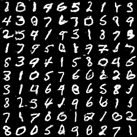

<!DOCTYPE html>

<h1>敵対的生成ネットワークにMNIST画像を生成させる</h1>

<h2>生成された画像</h2>

実際に生成された画像の一部を掲載します

他の画像についてはgenerated_imagesフォルダに格納してあります。

生成された画像名の末尾についている数字はその画像を生成した時のイテレーション回数となっています。

イテレーションを重ねるごとに本物の手書き数字と見分けがつかないような画像を生成できていることがわかります。

<h2>今回訓練したモデル</h2>

modelsフォルダに今回訓練したモデルを格納してあります。

「discriminator.h5」は画像を入力として受け取り、その画像が本物の手書き数字なのか、生成された手書き数字なのかを判定するモデルです。

「generator.h5」は実際に画像を生成するモデルです。

[-1, 1)の一様分布から取られた乱数を入力として受け取り、MNIST画像を生成します。
